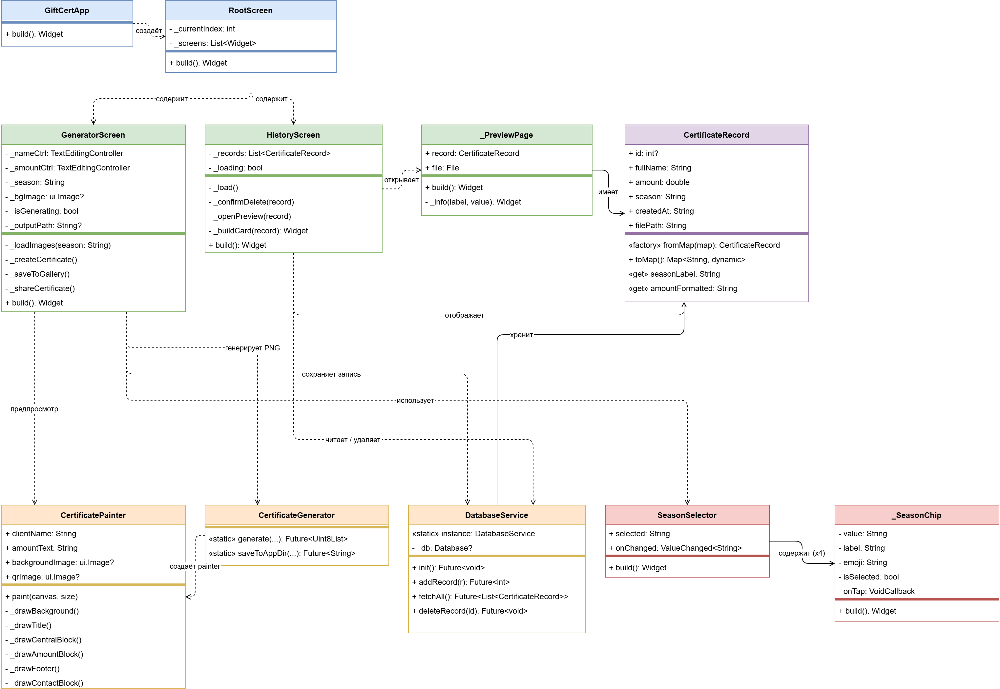
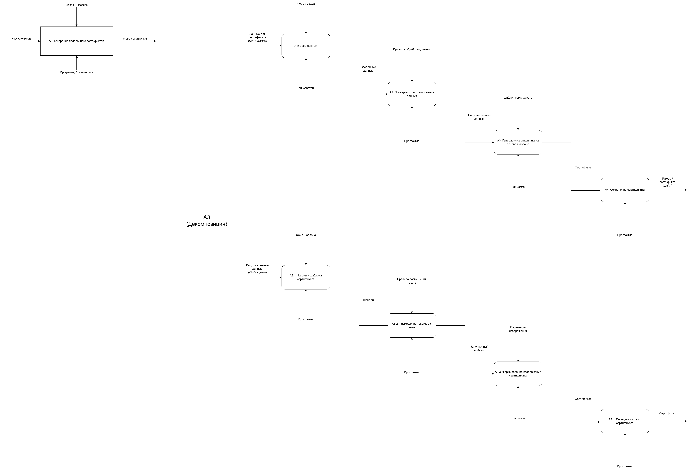
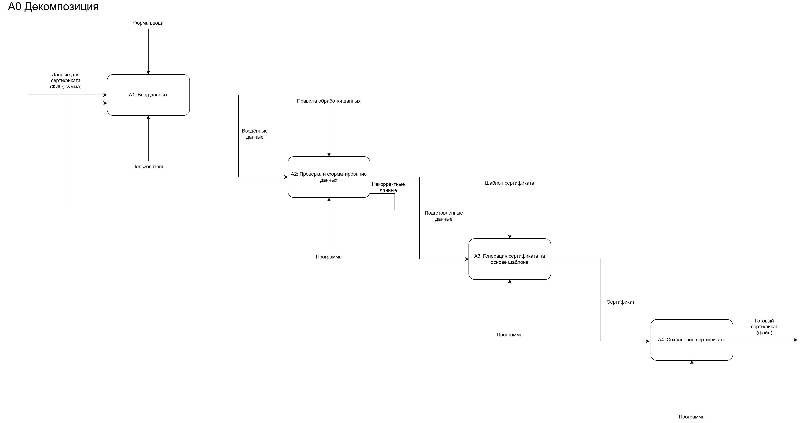
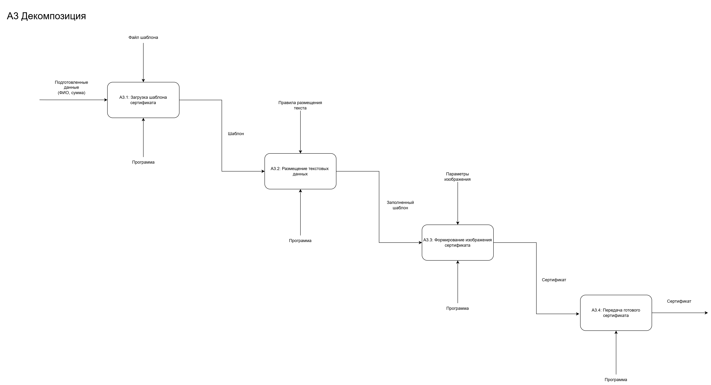

# Генератор подарочных сертификатов

АРМ мастера по перманентному макияжу - программа для создания персонализированных подарочных сертификатов.

Мастер вводит имя клиента, сумму и выбирает сезонное оформление. Программа генерирует готовый PNG-файл высокого разрешения (4096x2304 px), который можно распечатать или отправить клиенту.

Проект реализован в двух версиях:
- **Десктопная** - язык C++, фреймворк Qt6, платформа Windows
- **Мобильная** - язык Dart, фреймворк Flutter, платформа Android

---

## Видео-отчёт

[](https://rutube.ru/video/3285f0baf91994fe70257126a6dc2325/?r=wd)

---

## Возможности

- Ввод имени клиента и суммы сертификата
- Четыре сезонных шаблона: лето, осень, зима, весна
- Живой предпросмотр в реальном времени (мобильная версия)
- Генерация PNG-сертификата высокого разрешения
- Сохранение в галерею и отправка через мессенджер (мобильная версия)
- История созданных сертификатов с хранением в SQLite
- Просмотр и удаление записей из истории

---

## Дизайн сертификата

Текст и элементы сертификата рисуются программно на Canvas, что обеспечивает одинаковый результат на любом устройстве.

Шрифты:

| Элемент | Шрифт |
|---------|-------|
| Заголовок | Playfair Display |
| Имя клиента | Great Vibes |
| Сумма и вспомогательный текст | Montserrat |

Цветовая палитра: тёмно-коричневый и золотой.

---

## Архитектура

### Мобильная версия (Flutter)



### Десктопная версия (Qt / C++)


---

## Технологии

### Мобильная версия

| Технология | Назначение |
|-----------|-----------|
| Flutter / Dart | Основной фреймворк и язык |
| sqflite | Локальная база данных SQLite |
| path_provider | Работа с файловой системой |
| gal | Сохранение изображений в галерею |
| share_plus | Отправка файлов через мессенджер |
| intl | Форматирование дат и чисел |

### Десктопная версия

| Технология | Назначение |
|-----------|-----------|
| C++17 | Язык программирования |
| Qt6 Widgets | Графический интерфейс |
| Qt6 SQL | Работа с базой данных |
| SQLite | Локальное хранение истории |
| CMake | Система сборки |

---

## Структура проекта

```
lib/
    main.dart
    models/
        certificate_record.dart
    screens/
        generator_screen.dart
        history_screen.dart
        preview_page.dart
    services/
        certificate_generator.dart
        database_service.dart
    widgets/
        season_chip.dart
assets/
    certificate_template_summer.png
    certificate_template_autumn.png
    certificate_template_winter.png
    certificate_template_spring.png
fonts/
    PlayfairDisplay-Regular.ttf
    GreatVibes-Regular.ttf
    Montserrat-Regular.ttf
docs/
    uml_class_diagram_light.png
    uml_class_diagram_dark.png
    uml_class_diagram_desktop.drawio.png
```

---

## Сборка и запуск

### Мобильная версия (Android)

```bash
flutter pub get
flutter run
flutter build apk --release
```

### Десктопная версия (Windows)

```powershell
cmake -S . -B build
cmake --build build --config Release
.\build\Release\GiftCertificateGenerator.exe
```

---

## IDEF0 диаграмма

### A0 - Общая функция



### A0 - Декомпозиция



### A3 - Декомпозиция



---

## Документация

- [UML-диаграмма Flutter (светлая)](docs/uml_class_diagram_light.png)
- [UML-диаграмма Flutter (тёмная)](docs/uml_class_diagram_dark.png)
- [UML-диаграмма Qt/C++](docs/uml_class_diagram_desktop.drawio.png)
- [Исходник диаграммы Flutter (.drawio)](uml_class_diagram.drawio)
- [Исходник диаграммы Qt (.drawio)](uml_class_diagram_desktop.drawio)
- [Исходник IDEF0 диаграммы (.drawio)](docs/idef0.drawio)
